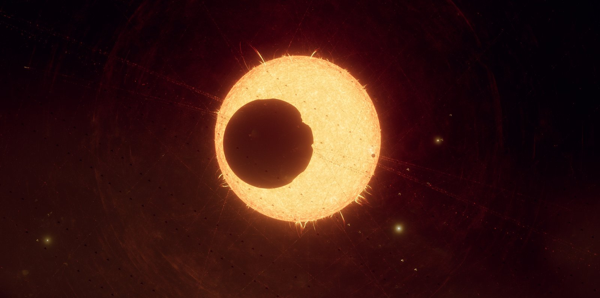
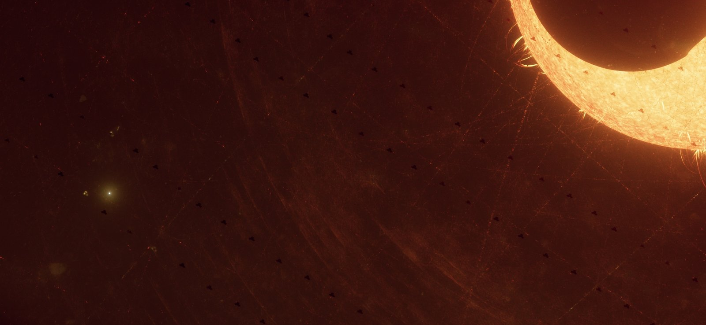
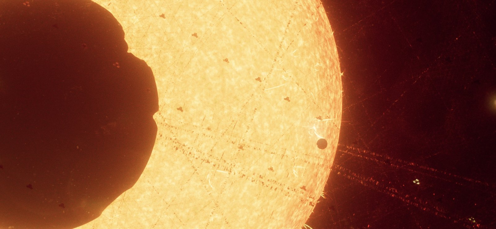

# Stapledon-swarm

Hard-SF world bible for Habitat-kit. One independently orbiting cell in the Kepler-62 Stapledon swarm. Not a novel. Not the generator.

| Path | Role |
| --- | --- |
| [`bible/`](bible/) | Human + AI context. Wiki, detail files, OPEN list. Not enforced by CI. |
| [`calc/`](calc/) · [`schema/`](schema/) | Enforceable. Calc tests and the constraint JSON Schema. |
| [`constraints/`](constraints/) | Constraint files. Every `*.json` file validates against `schema/`. |
| [`stills/`](stills/) | Key-art caches, two families (Git LFS). Habitat Cuts are generated from Habitat-kit. |

Key-art caches. These are not Habitat Cuts. Kepler system stills: the large irregular body is not Kepler-62b–f. Sol launch stills: original probes leaving Earth, 2085–2095 A.D. Notes in [`bible/wiki.md`](bible/wiki.md) §12–13.

### Leaving Earth, 2085–2095 A.D.


*`07-fleet`. Founding dispatch. Earth's limb. Several diamond lightsails. Visible count is camera selection, not batch size.*


*`04-boom`. Close. Hub, chassis, four spars. Dark bays are look-dev, not a mass-row change. Earth limb faint.*


*`05-cross`. Far. Edge-on. Membrane reads as a bright cross. Hub as a speck. Earth disk and atmosphere limb.*


*`06-face`. Close. Reflective diamond membrane, square-on-point. Face marks are look-dev illumination. They do not lock the beam.*

### Kepler-62 swarm



*`01-eclipse`. Wide. Star in the middle. Kepler-62 as a K disk, prominences visible. Large irregular body in silhouette (planets b–f are out). Swarm sits as stacked veils of independently orbiting cells.*



*`02-lattice`. Star shoved into a corner. Distant cells as repeated sharp silhouettes. Apparent rows are a camera effect, not a rigid lattice. Faint red traces, some haze. Small circular disk on the limb, if you see one, is not the large body.*



*`03-inward`. Camera already inside the swarm. Fine field of independent cells across the disk. Same irregular foreground body. Small circular transit is a different object. Habitat Cuts are not this shot.*

Launch diamonds are not Kepler cell silhouettes. Index: [`stills/README.md`](stills/README.md).

## 1. What this repo is

A world bible. Habitat-kit and the rest of the Plygonality stack read it. `bible/` is the readable frame. `calc/` and `schema/` are what CI can fail.

| File | Job |
| --- | --- |
| [`bible/wiki.md`](bible/wiki.md) | Numbered wiki. Claims tagged. Summaries link to detail files. |
| [`bible/probes.md`](bible/probes.md) | Payload, picotechnology, laser-sail family, hop limits, launch look-dev. |
| [`bible/chronology.md`](bible/chronology.md) | Three clocks. Gregorian A.D. timeline. Passage vs capture. |
| [`bible/lineages.md`](bible/lineages.md) | Batch lineages as architectural ancestry. |
| [`bible/preservation.md`](bible/preservation.md) | Competing Earth reconstructions. |
| [`bible/featured-cell.md`](bible/featured-cell.md) | Featured relic social history vs physical failure. |
| [`bible/appendix-launch.md`](bible/appendix-launch.md) | Launch integrals. Script: [`calc/lightsail.py`](calc/lightsail.py). |
| [`bible/production.md`](bible/production.md) | Thin map onto Habitat-kit / Time-slice / Blend-ci. Habitat-kit owns generator notes. |
| [`bible/open-questions.md`](bible/open-questions.md) | OPEN list. Leave it. |

Tags: [`schema/status-tags.md`](schema/status-tags.md). Constraint schema: [`schema/constraints.schema.json`](schema/constraints.schema.json). Physics: [`constraints/physics.json`](constraints/physics.json). Project rules: [`constraints/project-rules.json`](constraints/project-rules.json). Stills caches: [`stills/`](stills/).

## 2. What this is not

Habitat-kit lives in its own repo. No generator, no graphs, no apply scripts here.

Blend-ci cooks dumps. This repo does not run Blender or hash a PNG. Calc CI does not fetch stills and does not cook images.

No swarm integrator. No N-body. No cell-count engine.

Do not paste this into [Hard-SciFi-idea-generator](https://github.com/Plygonality/Hard-SciFi-idea-generator).

Scale is [Unit-canon](https://github.com/Plygonality/Unit-canon). `calc/` imports grid, deck, airlock, and figure from that package. We list the numbers once so you can read the table. We do not own them.

No named people, factions, religions, or generation-ship endings on a still or Habitat Cut. Do not invent named protagonists. Social history is allowed when tagged.

## 3. How to read the wiki

Start at [`bible/wiki.md`](bible/wiki.md). That file is the tagged index. If a still or a kit dump fights a tagged claim, the claim wins. Detail tables live in the files listed above. Do not duplicate them.

[`bible/production.md`](bible/production.md) is only the map onto Habitat-kit / Time-slice / Blend-ci. It does not add world facts. Do not grow it into a Habitat-kit playbook.

OPEN means unset. Do not invent the missing piece. Habitat-kit may do one cell, three Habitat Cuts, Unit-canon sockets. That is the scope.

## 4. How Habitat Cuts map

One cell. One hull. Epoch is a socket. IDs come from Time-slice. Habitat-kit does not fork that repo. Habitat Cuts are generated from Habitat-kit. They are not stored here.

| Habitat Cut | Time-slice id | Reads as |
| --- | --- | --- |
| construction | `construction` | Scaffold, incomplete, work lights, arcs |
| operational | `operational` | Closed hull, structured lights, wear |
| relic | `relic` | Empty habitation, protected archives, mixed repairs, leftover request |

Decay-pass and signal-field stay in Time-slice / Habitat-kit. We only say what the three states mean.

## 5. Binding numbers

Lengths below are for reading. Source file is Unit-canon. Edit there: https://github.com/Plygonality/Unit-canon. Calc imports them.

| Quantity | Work figure | Owner / note |
| --- | --- | --- |
| Distance Sol → Kepler-62 | 982 ly | This bible (CANON) |
| Peak and coast speed | 0.2c | After laser boost. Not automatically trip-average. 982 yr is light-travel (CANON) |
| Launch architecture | Laser-driven lightsail | Solar collectors may power the plant. Not a solar-wind sail (CANON) |
| Reference boost | ~226 s, ~0.049 AU, ~34 000 g | Adopted family, ideal reflector ([`calc/lightsail.py`](calc/lightsail.py)) |
| Unbraked coast | ~4 910 yr external / ~4 811 yr proper | 982 ly at 0.2c (INFERENCE) |
| Founding launch | 2085–2095 A.D. | Original probes. ~1 billion (CANON) |
| Unbraked Kepler passage | 6995–7005 A.D. | Not capture. Not settlement (INFERENCE) |
| Probe body | 1–10 g | Sail system extra (CANON) |
| Kepler-62 mass / luminosity | 0.76 M☉ / 0.26 L☉ | Work figures (CANON). Catalog scatter is OPEN. |
| Swarm outer radius | 3.6 AU | Independent orbits, not a rigid lattice (CANON) |
| Flux at 3.6 AU | ≈ 0.020 S☉ ≈ 27.3 W/m² | 0.26 / 3.6² × 1361 W/m² (INFERENCE) |
| Teq | ~120 K | Passive-exterior work figure under stated assumptions (CANON) |
| Grid | 1.0 m | [Unit-canon](https://github.com/Plygonality/Unit-canon) |
| Deck | 3.0 m | [Unit-canon](https://github.com/Plygonality/Unit-canon) |
| Airlock | 1.0 m | [Unit-canon](https://github.com/Plygonality/Unit-canon) |
| Human figure | 1.80 m | [Unit-canon](https://github.com/Plygonality/Unit-canon) |

The founding-launch and probe-body rows are the Sol stack in these frames. Sail extra. Not Kepler arrival.


*`07-fleet`. 2085–2095 A.D. near Earth. Visible count is not batch size.*


*`06-face`. 1–10 g body at the hub. Diamond is look-dev. Table diameters stay circular-equivalent.*


*`04-boom`. Body and support. Dark bays do not enlarge the 1–10 g budget.*


*`05-cross`. Laser-driven lightsail after deploy. Not a solar-wind sail.*

Mass-table correction (CANON): **1 mm @ 1% of a 3.6 AU sphere ≈ 0.012 M⊕**. **12 M⊕ is a 1 m plate @ 1%.** Plate-only examples, not total swarm mass. Someone swapped millimeters and meters. Drop the old 12 M⊕ @ 1 mm number.

## 6. Toolchain

| Repo | Role relative to this bible |
| --- | --- |
| [Habitat-kit](https://github.com/Plygonality/Habitat-kit) | Builds the cell. Reads this frame. Code is over there. Habitat Cuts are generated there. |
| [Time-slice](https://github.com/Plygonality/Time-slice) | Same seed, three epochs. Habitat Cuts use those IDs. |
| [Probe-kit](https://github.com/Plygonality/Probe-kit) | Crawler, drone, debris as instances. |
| [Unit-canon](https://github.com/Plygonality/Unit-canon) | Grid, deck, airlock, figure. Calc imports these. |
| [Collection-linter](https://github.com/Plygonality/Collection-linter) | Role checks against Unit-canon. Does not know Kepler-62. |
| [Blend-ci](https://github.com/Plygonality/Blend-ci) | Headless cook. Hash and lint. Not this CI. |

## 7. Calc tests

```bash
pip install -e ".[dev]"
pytest -q
```

Python 3.11+. No Blender. CI is [`.github/workflows/calc.yml`](.github/workflows/calc.yml): pytest only. It does not fetch LFS stills and it does not cook images.

[`calc/canon.py`](calc/canon.py) imports Unit-canon for meters / deck / airlock / figure. [`calc/lightsail.py`](calc/lightsail.py) keeps SI/IAU physics constants locally; Unit-canon has no fields for those.

## 8. Non-goals and OPEN items

Out of scope: Habitat-kit or Blend-ci code here; image jobs; a web UI; filling OPEN items; labeling the key-art body as planets b–f; copying Unit-canon into this repo as if we own it; extra image binaries outside [`stills/`](stills/); dumping Habitat-kit production notes into `bible/`. A reprint script in [`calc/`](calc/) is allowed. It is not a simulator.

OPEN list is only [`bible/open-questions.md`](bible/open-questions.md). Leave it. The stills do not name the large body.

Hop payload: 1–10 g body, sail extra, dormant WBE and ASI states, picobot seeds, digital archives. Living crew and generation ships are rejected, not left OPEN. A gram-class body does not run a civilisation. Destination braking stays OPEN.

MIT. [`LICENSE`](LICENSE).
