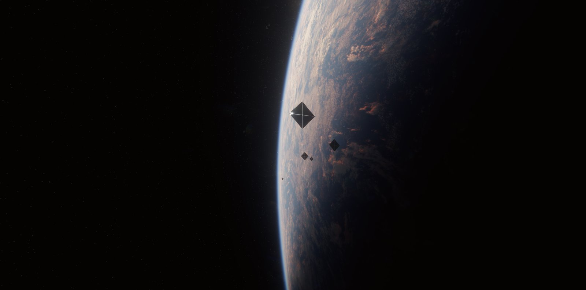
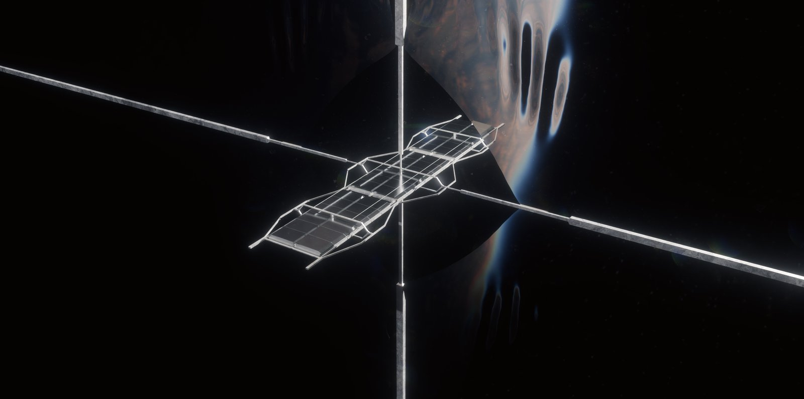
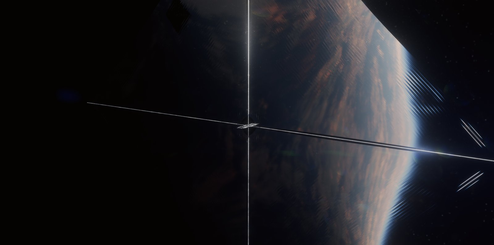
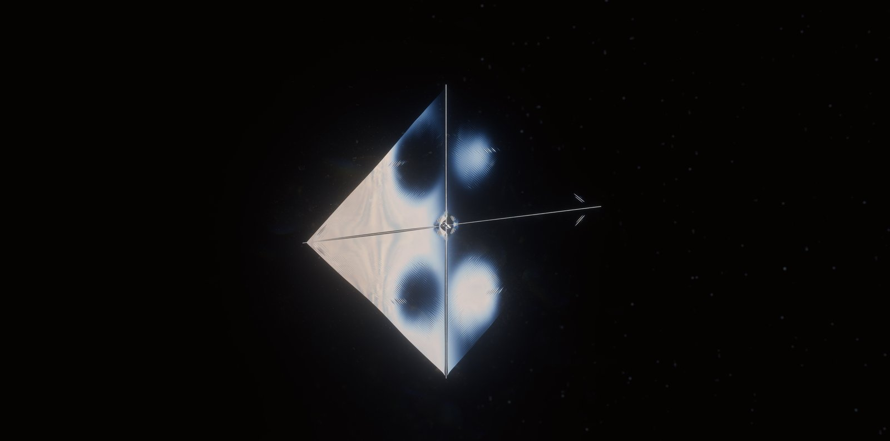

# Probes

Authoritative payload, picotechnology, launch family, hop limits, and launch-era look-dev. Wiki summaries link here. Launch integrals: [`appendix-launch.md`](appendix-launch.md). Script: [`../calc/lightsail.py`](../calc/lightsail.py). Launch stills: [`../stills/README.md`](../stills/README.md).

## 1. Origin programme

**CANON.** Between approximately 2085 and 2095 A.D., humanity and its digital descendants launch around one billion original autonomous Von Neumann probes.

**CANON.** They leave in batches of thousands toward Solar System sites (infrastructure and later habitation), nearby stellar systems, and more distant systems including Kepler-62.

**CANON.** Several batches may share a destination. A batch is one dispatch event. It is not necessarily a unique star.

**CANON.** The billion count is original dispatched units. It is not the later replica census.

**CANON.** Exact shares among local, nearby, and distant targets are OPEN. The 600 / 300 / 100 million split used in bible 0.3.0 is not canon.

**CANON.** The programme is fiction. It becomes possible through accelerated fictional work on human whole-brain emulation, ASI, consensual integrations of human-derived minds and artificial intelligences, extremely compact manufacturing and storage, and abiogenesis / biological reconstruction. Those are setting premises, not forecasts.

*`07-fleet`. 2085–2095 A.D. Batches of thousands. This frame shows a handful. Visible count is camera selection, not the billion and not the batch size.*

## 2. Probe body

**CANON.** The probe body has a mass of approximately 1–10 g.

**CANON.** "Body" includes the allocated mass of digital storage, dormant copied WBEs, stored ASI states, smaller specialised control systems, picobot manufacturing seeds, navigation and communication components, and assigned protection and structural hardware.

**CANON.** The sail system is additional mass. State that convention every time a launch mass is quoted.

**OPEN.** Exact component mass allocations inside the 1–10 g body.

**OPEN.** Whether the sail remains attached after the boost.

*`04-boom`. Close. 1–10 g body at the hub. Dark bays are look-dev. They do not enlarge the body budget. Sail system is extra and may be out of key.*

## 3. What runs in flight

**CANON.** Not every stored intelligence runs during flight.

**CANON.** Low-resource systems handle ordinary operations. More demanding minds need suitable power, hardware, and activation authority.

**CANON.** A 1–10 g body does not run a civilisation because it can store one.

**CANON.** Authorised activation consumes energy and is logged as experienced time.

## 4. Archive

**CANON.** Each original probe carries a comprehensive acquired Earth archive at its departure cutoff: biological reconstruction information, recorded history and cultural material, developmental and ecological information, copied minds, manufacturing descriptions, provenance, uncertainty, and known omissions.

**CANON.** The archive does not literally contain unrecorded history or every microscopic state of Earth.

**CANON.** 2085 launches freeze one cutoff. Later batches in the same decade, and later descendant launches, may carry revisions.

**OPEN.** Usable capacity, bit-error model, computing performance, replication rates, and repair method.

## 5. Picotechnology

**CANON.** Picotechnology is the setting’s term for fabrication and control at picometre precision, implemented through larger atomic and molecular assemblies.

**CANON.** "Picobots" is the conventional name of those machines. Complete robots are not a few picometres wide.

**CANON.** The technology requires energy, produces waste heat, and uses available matter. It cannot supply absent elements by ordinary chemical rearrangement. It depends on suitable feedstocks and staged manufacturing. It remains vulnerable to damage and common-mode failures.

**OPEN.** Whether an extra fictional-physics discovery adds subatomic machines. This bible does not assume it.

**CANON.** Compactness does not prove survival, usable capacity, or error-free replication.

## 6. Abiogenesis

**CANON.** The fictional breakthrough lets biological systems be started from appropriate nonliving feedstocks and validated instructions.

**CANON.** That is more than a synthetic genome placed into an existing cell.

**CANON.** It does not make every organism or ecosystem automatically reconstructible.

**CANON.** Interstellar hops carry instructions and manufacturing systems. They do not maintain living organisms for the whole trip.

## 7. Launch architecture

**CANON.** Default interstellar launch architecture:

1. Dispatch and deployment.
2. Laser-driven acceleration on a reflective lightsail.
3. Long unpowered interstellar coast.
4. A separately specified destination braking and capture phase, currently unresolved.

**CANON.** Interstellar acceleration to approximately 0.2c comes from directed laser light. Ordinary sunlight alone does not do that job.

**CANON.** Solar collectors may supply the launch infrastructure’s energy. Call the hop a laser-driven lightsail or a solar-powered laser launch. Do not call the interstellar burn a solar-sail cruise.

**CANON.** Sails do not interact primarily with the solar wind.

**CANON.** Direct sunlight can support suitable local manoeuvres.

**CANON.** 0.2c is both the adopted maximum and the coast speed of the original Kepler hop. It is not the trip-average speed if braking later occurs. 982 yr is light-travel, not ship time.

*`05-cross`. Dispatch and deploy, then laser boost. Membrane so thin it reads as a cross. Not a solar-wind sail. Not sunlight alone to 0.2c.*

## 8. Adopted sail family

**CANON.** Adopted engineering targets inside the fiction, not demonstrated hardware.

Assumptions: probe body 1–10 g; effective deployed sail-system areal density 0.1 g/m²; sail-system mass equals probe-body mass; effective loading includes the membrane and its allocated deployment / support system; nominal initial beam intensity 10 GW/m²; ideal near-perfect reflection for the baseline; circular sail for quoted diameters (equivalent-area figures; look-dev planform is diamond, §11).

| Probe body | Sail area | Diameter | Sail-system mass | Total launch mass | Nominal beam power |
| --- | --- | --- | --- | --- | --- |
| 1 g | 10 m² | 3.57 m | 1 g | 2 g | 100 GW |
| 5 g | 50 m² | 7.98 m | 5 g | 10 g | 500 GW |
| 10 g | 100 m² | 11.28 m | 10 g | 20 g | 1 TW |

**CANON.** This is a chosen example family. It is not a unique required sail size.

**INFERENCE.** Recalculated: \(A=m_\mathrm{sail}/\sigma\), \(d=2\sqrt{A/\pi}\), \(P=I_0 A\). Independent run of [`../calc/lightsail.py`](../calc/lightsail.py) matches the table.

**INFERENCE.** Same \(P/m\) on every row. Boost to 0.2c: launch-frame duration 226 s; onboard proper time 225 s; transmitter emission 202 s; distance 7.31 million km ≈ 0.049 AU; initial acceleration ≈ 34 000 g. See [`appendix-launch.md`](appendix-launch.md).

**INFERENCE.** Lower beam intensity, different loading, or a different acceleration distance produce different designs.

*`06-face`. Look-dev planform is diamond. Table diameters above stay circular-equivalent. Face marks are look-dev illumination. They do not lock beam count or aperture.*

## 9. Limits that stay visible

**CANON.** The following are not solved by assertion.

### Thermal

**INFERENCE.** At 10 GW/m², one part per million absorption is 10 000 W/m² absorbed at the initial illumination condition (\(\beta=0\)), if that ppm is taken of the nominal launch-frame intensity.

**CANON.** Reflectivity, absorptivity, emissivity, wavelength dependence, and Doppler shift are different quantities. Do not collapse them.

### Beam delivery

**INFERENCE.** An idealised 1 μm laser with a ~5 km aperture has a central Airy-spot diameter comparable to the 3.57 m sail at the reference acceleration endpoint. Order-of-magnitude diffraction estimate. It does not guarantee full power capture.

**OPEN.** Pointing, beam stability, sail control, losses, and aperture margin.

### Mechanical loading

**CANON.** Compact dormant payloads avoid biological acceleration limits. They still face structural loads. Sail force distribution and payload attachment require a design.

### Interstellar survival

**CANON.** The 1–10 g body budget must ultimately accommodate a defensible strategy for gas, dust, radiation, storage errors, and long-term degradation.

**CANON.** Redundancy and picotechnology do not automatically resolve that. Hoang et al. (arXiv:1608.05284) show why erosion and material damage matter on much shorter proposed hops. They do not size this fictional probe.

**OPEN.** The survival design that fits the body mass.

### Destination capture

**OPEN.** Braking and capture.

**CANON.** A laser behind a receding outbound probe does not ordinarily stop it at Kepler-62.

**CANON.** Ordinary Kepler-62 sunlight cannot capture a 0.2c probe.

**CANON.** Do not install a destination braking array by implication.

**CANON.** Settlement at Kepler-62 ultimately occurs. The mechanism that took original 0.2c probes from coast to bound orbits is an explicit engineering gap.

Research directions, none of them canon: a later-built in-system beamer whose own origin is explained; magnetic or plasma drag; staged remnant-sail manoeuvres after some other first capture; slower precursor infrastructure whose own arrival is explained. Listing a direction does not adopt it.

## 10. Obsolete 0.001 g model

**CANON.** Bible 0.3.0 used constant ~0.001 g burns, ~198 yr per burn, ~5 106 yr total, and a 7191–7201 A.D. arrival band. That default is withdrawn.

Keep those figures only as labelled history. Do not add the old 194- or 198-year braking burn unless a compatible braking system is specified and justified.

## 11. Launch-era look-dev

Stills: [`../stills/04-boom.jpg`](../stills/04-boom.jpg), [`../stills/05-cross.jpg`](../stills/05-cross.jpg), [`../stills/06-face.jpg`](../stills/06-face.jpg), [`../stills/07-fleet.jpg`](../stills/07-fleet.jpg). Captions: [`wiki.md`](wiki.md) §13.4–13.7.

**CANON.** Those four frames depict original probes leaving Earth in the 2085–2095 A.D. window. They are Sol-departure stills. Earth is Earth.

**CANON.** Look-dev planform: square-on-point (diamond) membrane, four spars, gram-class body at the hub. Edge-on the stack reads as a thin cross.

**CANON.** The adopted family table quotes circular diameters as equivalent-area figures. Those rows do not require a circular membrane in the stills.

**INFERENCE.** A square of equal area has a longer diagonal than the circular diameter. The diffraction note in §9 and [`appendix-launch.md`](appendix-launch.md) stays an order-of-magnitude check against the circular row. It is not re-fit to the diamond.

**CANON.** The stills do not lock sail area, boom length, membrane thickness, chassis bay count, or whether the sail stays attached after the boost.

**CANON.** Marks on the reflective face are look-dev illumination. They do not lock beam count, wavelength, aperture, or pointing. Those stay OPEN as in §9.

**CANON.** A fleet frame may show a handful of units. Visible count is camera selection. A batch is still of order 1 000.

**CANON.** Launch diamonds are gram-class sails at Sol. Kepler key-art diamonds are system-scale cell silhouettes. Do not swap the two.

**CANON.** Dark bays on the hub in `04-boom` are look-dev on the body and support. They do not enlarge the 1–10 g body budget.

*`04-boom`. Close. Hub, chassis, four spars. Earth faint.*

*`05-cross`. Far. Edge-on cross on Earth's disk.*

*`06-face`. Close. Reflective diamond face. Marks are look-dev.*

*`07-fleet`. Wide. Several diamonds on Earth's limb. Visible count is not batch size.*
